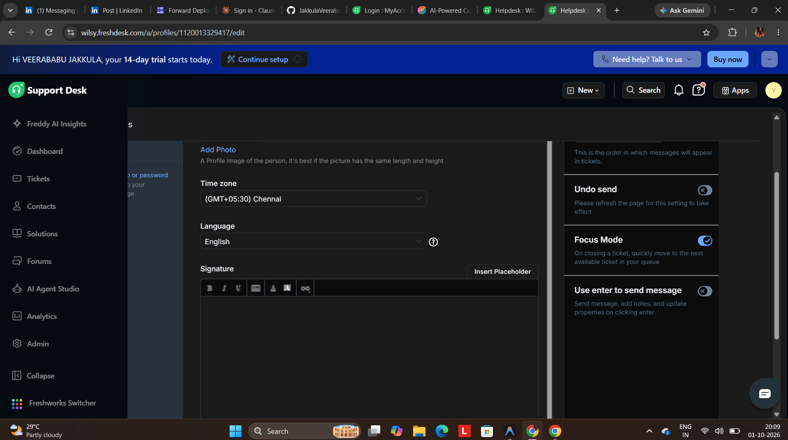
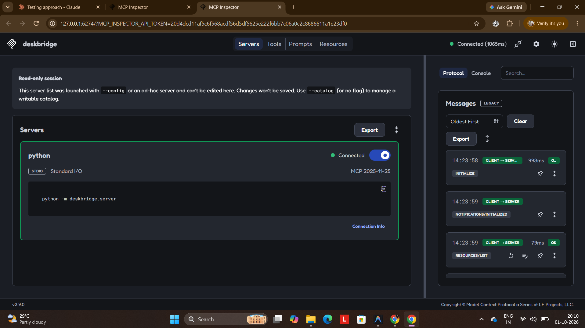
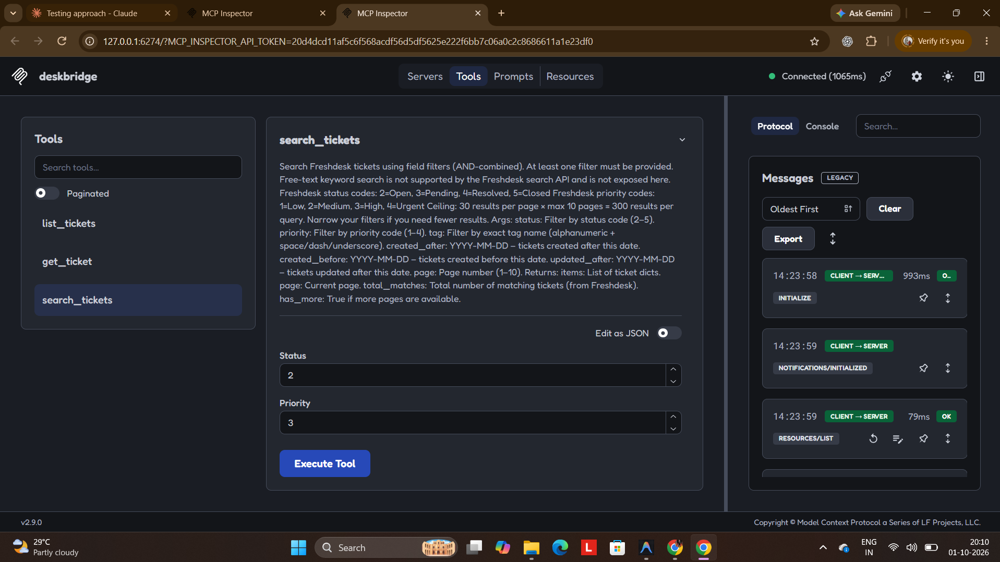

# DeskBridge

> **Read-only MCP server for Freshdesk** – list, fetch, and search support
> tickets with API-key auth, 429 / Retry-After backoff, pagination, and PII
> masking. Built for Razorpay Agent Studio.

---

## Why this exists

An Agent Studio agent helping a merchant support team needs safe, bounded
access to Freshdesk tickets. DeskBridge provides exactly three read-only
tools – nothing more. The connector cannot write, and a prompt-injected agent
cannot modify or delete tickets because those endpoints do not exist in the
server.

---

## Tools at a glance

| Tool | What it does |
|---|---|
| `list_tickets` | Paginated list of recent or updated tickets |
| `get_ticket` | One ticket by ID, with optional conversation thread |
| `search_tickets` | Filter by status, priority, tag, and/or date (AND-combined) |

Full input/output schemas → [`docs/TOOL_SPEC.md`](docs/TOOL_SPEC.md)  
What the agent can and cannot do → [`docs/CAPABILITIES.md`](docs/CAPABILITIES.md)

---

## Screenshots

**1. Smoke Test (Live API with PII Masking):**  


**2. MCP Inspector Setup:**  


**3. MCP Inspector Results (Search Tickets):**  


---

## Quick start

### 1. Get a Freshdesk API key

1. Sign up for a free trial at [freshdesk.com](https://freshdesk.com).
2. Your domain is `<yourname>.freshdesk.com`.
3. Profile picture (top-right) → **Profile Settings** → **View API Key**.

### 2. Install

```bash
git clone https://github.com/<you>/deskbridge-freshdesk-mcp
cd deskbridge-freshdesk-mcp

python3 -m venv .venv
# Linux / macOS
source .venv/bin/activate
# Windows (PowerShell)
.venv\Scripts\Activate.ps1

pip install -e ".[dev]"
```

### 3. Configure

```bash
cp .env.example .env
# Edit .env and set FRESHDESK_DOMAIN and FRESHDESK_API_KEY
```

`.env` is git-ignored and never committed. See `.env.example` for all options.

### 4. Run the tests

```bash
pytest -q
```

All tests use mocked HTTP (respx) – no network access required.

### 5. Seed fake tickets (optional)

Populates your trial account with 12 fictional tickets so you have something
to read. The descriptions contain fake emails and phone numbers deliberately,
so you can see PII masking in action.

```bash
python scripts/seed_tickets.py
```

### 6. Smoke test against your live account

```bash
python scripts/smoke_test.py
```

Exercises all three tools against your real trial account and prints
the (masked) results.

### 7. Run the MCP server

```bash
# stdio transport (used by agents and MCP Inspector)
python -m deskbridge.server
```

Or via the installed entry point:

```bash
deskbridge
```

### 8. Inspect with MCP Inspector

```bash
npx @modelcontextprotocol/inspector python -m deskbridge.server
```

Open the printed URL, select a tool, and call it interactively.

---

## Wire into an agent (stdio config)

```json
{
  "mcpServers": {
    "deskbridge": {
      "command": "python",
      "args": ["-m", "deskbridge.server"],
      "env": {
        "FRESHDESK_DOMAIN": "yourcompany",
        "FRESHDESK_API_KEY": "<set in your secret store>"
      }
    }
  }
}
```

For Agent Studio specifically, use the same form but replace `FRESHDESK_API_KEY`
with a reference to your secret store rather than a literal value.

---

## Design decisions

### Read-only by construction
No write tools exist. A prompt-injected agent cannot modify tickets because
there is no path to do so – not a permission check, not a missing scope, just
no code.

### Validated query builder
`search_tickets` assembles the Freshdesk `?query=` string from individually
validated fields. The agent never passes raw query text, so it cannot inject
Freshdesk query operators or escape the enclosing quotes.

### PII masking by default
All text fields (subject, description, conversation body) pass through
`pii.mask_text` before being returned. Emails are partially masked
(`r***@domain.com`); phone numbers are reduced to their last two digits.
Set `DESKBRIDGE_MASK_PII=false` in `.env` to disable (useful during debugging
against a private trial account; never do this in production).

### Page-size cap
`per_page` is capped at `DESKBRIDGE_MAX_PAGE_SIZE` (default 30) regardless
of what the caller requests. Freshdesk itself caps the list endpoint at 100.

### Logging to stderr, never stdout
stdout carries the MCP protocol framing. Any stray `print()` would corrupt the
stream. All diagnostics use Python's `logging` module (stderr).

---

## Rate limiting

| Condition | Behaviour |
|---|---|
| HTTP 429 | Reads `Retry-After` header (capped at 60 s); retries up to `max_retries` (default 5) times |
| HTTP 5xx | Exponential backoff: 1, 2, 4, 8, 16 s with 0–0.5 s jitter |
| Network error | Same exponential backoff |
| HTTP 401 / 403 / 404 | Immediately raises; never retried |

`X-Ratelimit-Remaining` is logged at WARNING level on each 429 response.

---

## Environment variables

| Variable | Required | Default | Description |
|---|---|---|---|
| `FRESHDESK_DOMAIN` | ✅ | – | Subdomain only (e.g. `acme`, not `acme.freshdesk.com`) |
| `FRESHDESK_API_KEY` | ✅ | – | API key from Freshdesk Profile Settings |
| `DESKBRIDGE_MASK_PII` | | `true` | Set to `false` to disable PII masking |
| `DESKBRIDGE_MAX_PAGE_SIZE` | | `30` | Max tickets per page for `list_tickets` |

---

## Limitations

See [`docs/CAPABILITIES.md`](docs/CAPABILITIES.md) for the full list, including
the 300-result search ceiling, regex-based PII masking caveats, shared API key
limitations, and the production-grade path for each.

---

## Security

- No secrets in this repository. `.env` is git-ignored.
- The seed and smoke-test scripts use only fictional data.
- Do not share your `.env` file or commit it.
- Rotate your Freshdesk API key immediately if it ever appears in `git log`.

---

## Project structure

```
deskbridge-freshdesk-mcp/
├── src/deskbridge/
│   ├── __init__.py      # package version
│   ├── config.py        # Settings loaded from env vars
│   ├── client.py        # HTTP client with retry / backoff
│   ├── pii.py           # Email + phone masking, truncation
│   ├── search.py        # Validated Freshdesk query builder
│   ├── models.py        # Field whitelisting + PII routing
│   └── server.py        # FastMCP server with 3 tools
├── tests/
│   ├── test_client.py   # 429 / 5xx / auth / success path tests
│   ├── test_pii.py      # Masking and truncation tests
│   ├── test_search.py   # Query builder + injection rejection tests
│   └── test_server.py   # Tool-level integration tests (mocked HTTP)
├── scripts/
│   ├── seed_tickets.py  # Creates 12 fake tickets in your trial
│   └── smoke_test.py    # Exercises all tools against the live API
├── docs/
│   ├── CAPABILITIES.md  # What the agent can and cannot do
│   └── TOOL_SPEC.md     # Full input/output schemas
├── .env.example
├── .gitignore
└── pyproject.toml
```

---

## Running tests

```bash
pytest -q                    # all tests, quiet output
pytest tests/test_client.py  # client retry / backoff tests only
pytest -v                    # verbose (shows each test name)
```

Tests use [respx](https://github.com/lundberg/respx) to mock HTTP and
monkeypatch `asyncio.sleep` so the 429 / 5xx retry tests run instantly
without real waits.

---

## Assumptions

1. Python ≥ 3.10.
2. One Freshdesk account per server instance (single domain + API key).
3. The API key has agent-level read access to all tickets.
4. The environment running the server can reach `*.freshdesk.com` over HTTPS.
